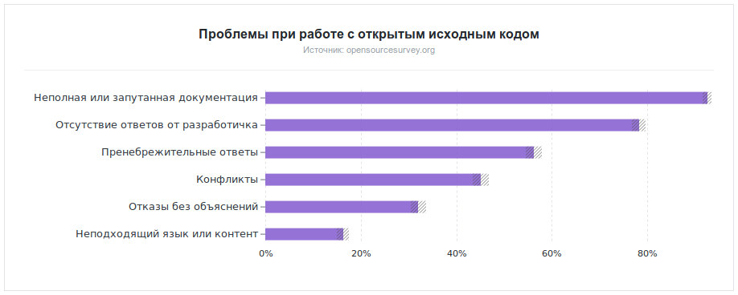

Зачем писать документацию?
==========================

В 2017 году GitHub `опросил <https://opensourcesurvey.org/2017/>`_ более 5000 разработчиков, чтобы
узнать об их опыте работы с проектами с открытым исходным кодом. Среди названных участниками опроса
проблем, на первом месте — проблема документации:

.. pull-quote::

   **«Неполная или устаревшая документация является широко распространенной проблемой, наблюдаемой
   93% респондентов»**

Ссылки
------

* `Why Documentation Is Important <https://www.fastspot.com/publications/why-documentation-is-important/>`_,
  Tracey Halvorsen (`Fastspot <https://www.fastspot.com/>`_)
